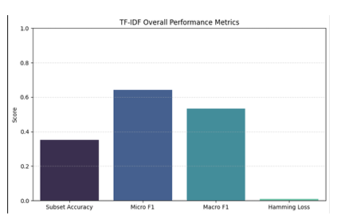

# StackOverflow Tag Predictor

This project aims to predict relevant tags for StackOverflow questions using two different approaches:
1. **TF-IDF + Logistic Regression** – A traditional NLP approach.
2. **DistilBERT (Transformer-based model)** – A deep learning approach.

## 📖 Project Description
The main objective is to compare a traditional ML method with a transformer-based deep learning method for **multi-label classification**.

- Dataset: Simplified version of StackOverflow questions. Simplified because of the real data was about millions. 
To upload git, just took a sample for it (`Questions.csv` & `Tags.csv`)
- Models compared: `TF-IDF + Logistic Regression` vs `DistilBERT`
- Evaluation Metrics: Precision, Recall, F1-score

## 📊 Results Summary
- **TF-IDF**: Faster training, less computationally expensive, decent results.
- **DistilBERT**: Better semantic understanding, higher F1, but requires more resources.

Example figure from the study:

              (paper/example_results-distilbert.png)

(see full analysis in the included paper: [Alperen_Keles-Article.pdf](paper/Alperen_Keles-Article.pdf))

## 📂 Repository Structure
- `data/`: Sample datasets (small size, original StackOverflow dataset was ~20GB)
- `notebooks/`: Model training and evaluation notebooks
- `models/`: Placeholder for trained models (excluded due to large size)
- `paper/`: Full project paper
- `requirements.txt`: Dependencies

## 🚀 How to Run
```bash
git clone https://github.com/<alperenks>/stackoverflow-tag-predictor.git
cd stackoverflow-tag-predictor
pip install -r requirements.txt
```

Open Jupyter notebooks inside `/notebooks` to train and test models.

## 📌 Notes
- Full dataset was from [Kaggle: StackLite/StackOverflow Dataset](https://www.kaggle.com/).
- Here we provide **lightweight samples** to demonstrate pipeline.
- You can replace sample CSVs with the full dataset for complete experiments.
